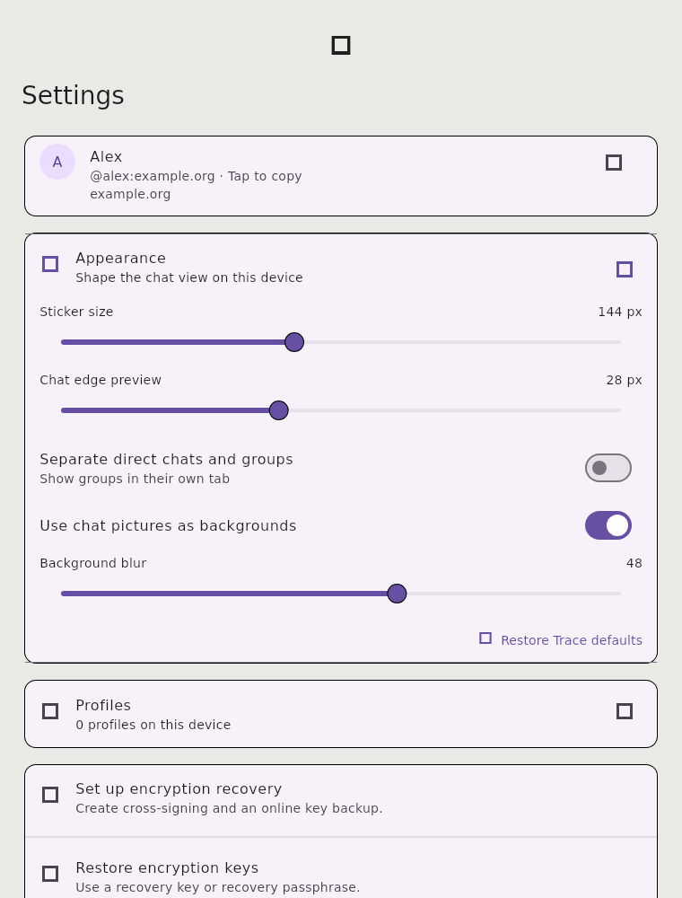
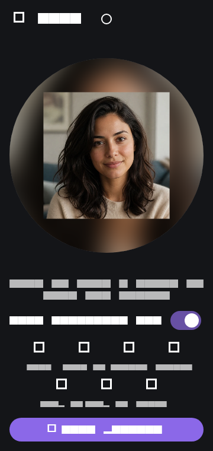
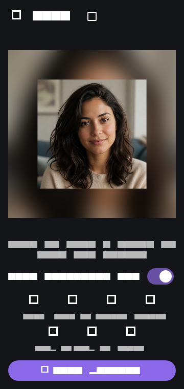
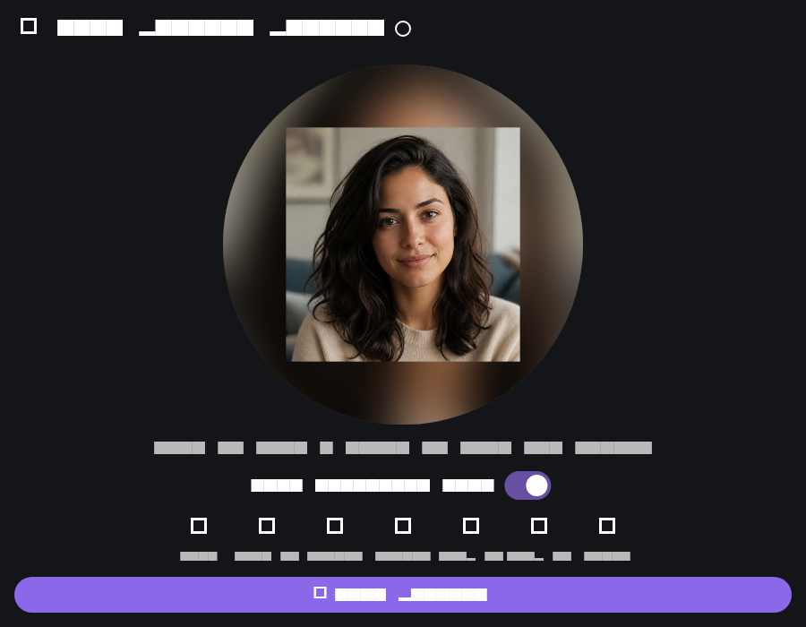

# Settings appearance decision

The account card remains first so a profile picture is easy to find. Appearance
controls sit immediately below it and expand in place. A local reset restores
Trace's current look: 144 px stickers, a 28 px chat edge preview, combined chat
list, profile picture backgrounds, and blur 48. This keeps existing users on
the intended visual design while allowing adjustments without server state.

The full selected profile image and its framing values are stored on this
device. Matrix receives a 512 px square render. Selections above 30 MB are
scaled down with their full aspect ratio before local storage. The stored
source is tagged with the exact uploaded Matrix avatar URI. Older source files
whose URI marker is stale are recovered only when they reproduce the current
uploaded avatar. An avatar changed by another client cannot silently reuse a
different local source. When no matching source exists, the profile dialog explains
that only the uploaded square is available.

Controls repaint as values change; preference writes are grouped after a short
pause in dragging. Edit picture sits beside Replace picture in the profile
dialog, while the display name waits for a deliberate tap. The picture editor
supports drag, pinch zoom, pinch rotation, quarter-turn rotation, flips, and
reset. A small white outlined shape button in the top bar switches between the
circular avatar and the full square upload, with an animated preview change.
It sits within the system safe area so phone camera cutouts do not cover its
touch target. A blur switch appears only when the framing exposes space or the
source has transparency.
PNGs and other transparent images leave that space transparent by default;
turning blur on fills it with a softened copy of the source. Opaque non-PNG
images keep Trace's blurred default when space is exposed.

The editor preview and Matrix upload use the same painter. A prominent Save
picture button renders the uploaded PNG before closing the editor, then commits
the profile edit directly. On Linux, Replace picture opens the Zenity chooser
first when available and falls back to the platform picker.
Older locally stored framing values are converted when their source image is
opened.

These are widget previews. The test renderer substitutes placeholder glyphs for
text and Material icons; the app uses its normal fonts and icons at runtime.
